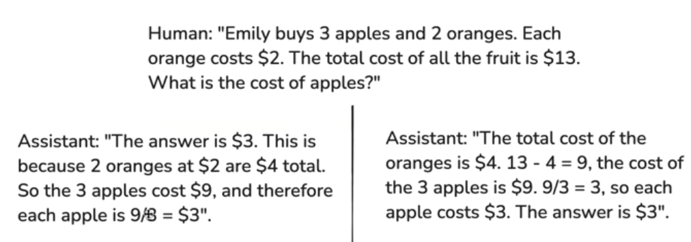
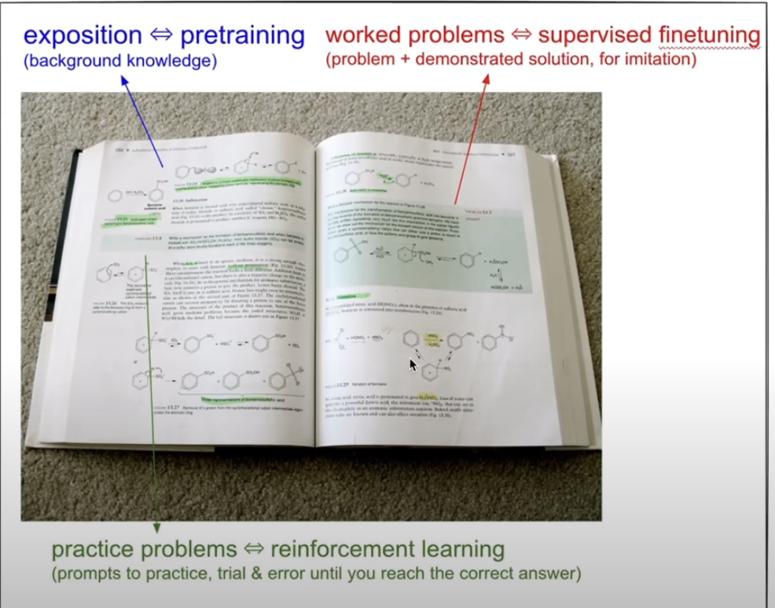
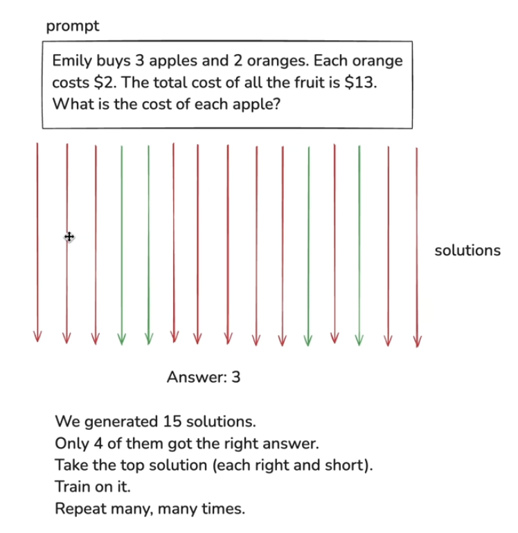
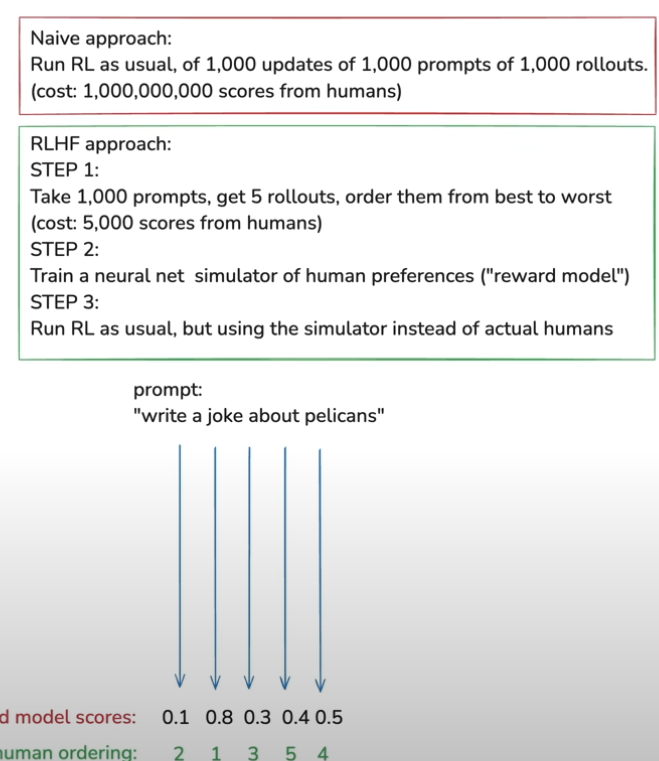

Here are some notes taken while wotching the video on LLMs created by Andrej Karphathy. Thank you, Andrej!

- The video itself: https://www.youtube.com/watch?v=7xTGNNLPyMI&ab_channel=AndrejKarpathy

- How data is being tokenized: https://tiktokenizer.vercel.app/

- Visualisation of CNNs: https://bbycroft.net/llm

## Initial training

It involves data crawling, parsing, clearing out. Then tokenizing and feeding into CNN. The weights are adjusted and as a result we have BASE or completion models. This process is extremely computational intensive.

## *-instruct models

Means that they are not just BASE models but also were taught by huge set of “few-shot” conversations created by human experts and labellers.

## Few-shot learning

Ball: Ball, Dog: Hund, Cat: …

Here LLM adds “Katze” based on the few shots.

## "Vague recollection" vs. "Working memory"

Knowledge in the parameters == Vague recollection (e.g. of something you read 1 month ago)
Knowledge in the tokens of the context window == Working memory.

Working memory is usually done by pre-feeding (copy&paste) data in the general prompt or by RAG solutions.

## LLM’s Self

It is input-output pure function, no self! Each times it starts, runs its statistic/stochastic stuff and then shuts off.

During the fine-tuning it gets this “self” during fine-tuning or based on the similar data in the internet. So it can hallucinate easily.

Still, you can program this out.

## It needs tokens to “think”

Left is significantly worse! It gives immediately the answer. That is totally bad for training. It reads and generates tokens from left to right.

On the right, we show ongoing process, we create interment calculations.

So it builds its own context window, building tokens one by one, and helping itself to come to the answer.

### Hint by Andrej — ask to lean on tools

For such kind of questions it is better to ask “use code”, because it would do a solution more reliable. LLM uses a tool, it is not relying on its mental arithmetic.

You can also ask “use code interpreter” or “use web search”.

**Lean on tools whenever it is possible.**

Model is not good at thinking. Model is good at copy&pasting.

### Models do not think

Models can’t count.

Models do not see letters, characters, they are not good at spelling now. They usually have tokens that may include many char-s within single token.

### SFT model

Supervised fine-tuned model. It is the result of this post-training step. It kinda mimics the expert’s solutions, statistically.

## Reinforcement learning

Next step in post-learning process, based on SFT model. It goes beyond mimics and goes to reasoning.

So it is kinda we get “pre-training” by reading the theory, then we have worked problems resolved by a professional (author of the book) to learn how to solve the problems.

Then, we can have a task to resolve and the final answer to compare with ours result, but solution we build on our own. And here we go with reinforcement.

Our knowledge is not LLMs knowledge. But we (human experts / labellers) give a hint of our cognition by providing samples.

We need to encourage solutions that lead to correct answers.

We decide which is the best and then feed it to the model.

### RL (”thinking”) Model

It is reinforcement learning model.

It is about refrain, backtrack, reevaluate — it is so-called chain-of-thought. The model discovers the way to think.

Check the result of different perspectives. It is not hardcoded or shown by example. We just give the answer and it tries to find the most effective solution.

Another name is “reasoning” model. DeepSeek was first who has represented this into a wide public.

## [together.ai](http://together.ai)

The resource you can use to use deployed models not by main players. E.g. you can talk to DeepSeek R1 without interacting with their actual hosts (as a company). You can also do it in Azure, still it is not as user-friendly as [https://together.ai](https://together.ai)

### Reinforcement learning in un-verifiable domains ⇒ RLHF (Reinforcement learning with Human Feedback)

E.g. jokes, humour, poems. There is a problem to score well so “LLM Judge” is not so helpful, so we use human feedback.

Neural Network (reward model, complete separate neural network) can build based on that simulation of human preferences.

So, we’re slightly nudging weights iteratively until it aligns well with human scores.

### Discriminator — generator gap

It is easier for human to discriminate than to generate. So, human labeller would rather pick one of the best responses (poem .e.g.) instead of writing his own one.

### Downside

It can still go wrong as RN can find a way to “outsmart” the scoring. So it can find a way to trick the scoring model and bring shitty results.

## Something is good, something is not

At some tasks LLMs are great, at some tasks they are not so good. Keep in mind, they are tools.